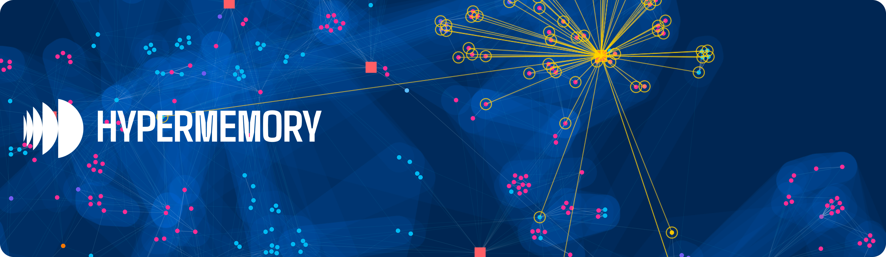
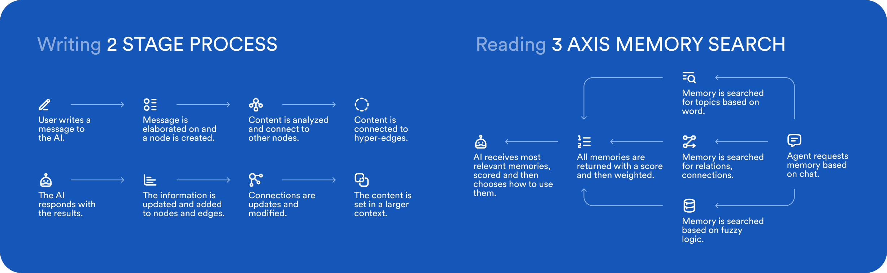

# HyperMemory

**Persistent memory for AI agents, built on hypergraph technology.**

     

     

HyperMemory is the long-term memory layer that gives AI agents the ability to remember, reason, and build on previous interactions. Instead of treating memory as simple keyword lookups or semantic similarity search, HyperMemory uses a hypergraph — a mathematical structure that models complex, multi-layered relationships the way the human mind draws connections. The result is memory that compounds over time, becoming more valuable with every interaction.

---

## Why HyperMemory

**Your AI forgets everything between conversations. HyperMemory fixes that.**

Every conversation with an AI starts from zero. Context evaporates, decisions are lost, and your agent has no idea what happened yesterday. HyperMemory changes this by giving agents a persistent, structured knowledge graph that survives across sessions, tools, and even different AI providers.

**Ecosystem freedom.** Your memory belongs to you, not to any single AI vendor. HyperMemory works across Claude, ChatGPT, Cursor, Windsurf, and any MCP-compatible client. Switch models without losing what your agent has learned.

**Compounding knowledge.** Every interaction enriches the graph. Facts, decisions, preferences, and relationships accumulate into a living knowledge base that makes your AI smarter over time — not just in this session, but in every future one.

**Structured reasoning, not fuzzy search.** HyperMemory goes beyond RAG. Hyperedges capture joint-necessity relationships between three or more concepts, enabling the kind of multi-hop reasoning that flat vector stores cannot support.

**Knowledge sovereignty.** Your data stays yours. Tenant-isolated, GDPR-aware, and designed so that your intellectual history is an asset you control.

---

## Get Started

**Application** — [app.hypermemory.io](https://app.hypermemory.io)
Sign up, connect your AI tools, and start building persistent memory.

**Documentation** — [docs.hypermemory.io](https://docs.hypermemory.io)
Guides, API reference, tool documentation, and integration walkthroughs.

**MCP Server** — `https://api.hypermemory.io/mcp`
Connect any MCP-compatible AI client (Claude Desktop, Cursor, Windsurf, and more) with a single URL. Supports OAuth and API key authentication.

---

## Public Repositories

| Repository | Description |
|---|---|
| [hypermemory-mcp](https://github.com/hypermemory-ai/hypermemory-mcp) | MCP server integration — setup guides for Claude, Cursor, ChatGPT, and other clients. The 17-tool MCP surface for reading and writing memory. |
| [hypermemory-cli](https://pypi.org/project/hypermemory-cli/) | Python command-line interface for HyperMemory. Install via `pip install hypermemory-cli`. JSON output, composable with `jq` and shell scripts. |
| [hypermemory-sdk](https://github.com/hypermemory-ai/hypermemory-sdk) | TypeScript SDK for programmatic access to the HyperMemory API. |
| [hypermemory-skill](https://github.com/hypermemory-ai/hypermemory-skill) | Agent skill definitions (SKILL.md) that teach AI agents how to use HyperMemory — enforced behavior, tool reference, graph hygiene, and style contracts. |

---

## How It Works

HyperMemory stores knowledge as a hypergraph of **nodes**, **edges**, and **hyperedges**.

**Nodes** are discrete pieces of knowledge — a person, a decision, a technology, a preference — each with a canonical type from a controlled ontology.

**Edges** connect two nodes with a described relationship that explains *why* they are related, not just *that* they are.

**Hyperedges** connect three or more nodes in a single joint-necessity relationship — meaning removing any participant changes the meaning of the whole group. This is what enables multi-hop reasoning and complex knowledge assembly that flat key-value or vector stores cannot achieve.

Agents interact with HyperMemory through the MCP server, the CLI, or the SDK. On every turn, the agent recalls relevant context, stores new facts, updates existing ones, and maintains graph hygiene — all transparently, without user intervention.

---

## Connect

- **Website** — [hypermemory.io](https://hypermemory.io)
- **Documentation** — [docs.hypermemory.io](https://docs.hypermemory.io)
- **Application** — [app.hypermemory.io](https://app.hypermemory.io)

---

*Built by the HyperMemory team.*
